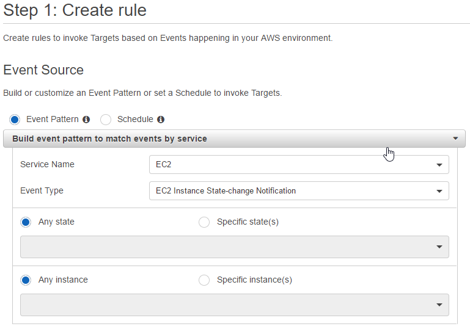
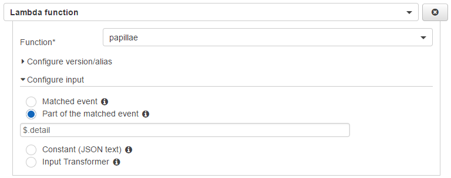
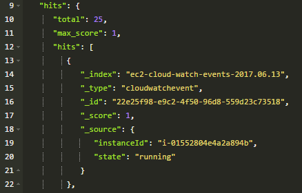

# cottondrop

Amazon Lambda function for shipping EC2 instance events to Elasticsearch.

## Setup

Once you've uploaded the lambda, the only real setup you need to perform for this lambda is the CloudWatch > Events > Rules.

### Event source

Setup the source of the events:

### Targets

Add your lambda function as a target for the event:

## Output

An example Elasticsearch document once the function has run:

## Usage

### Environment variables

* **(Optional)** DATESTAMP_ELASTIC_INDEX = Automatically append the current date (2017.14.06) to the ELASTICSEARCH_INDEX.
* **(Required)** ELASTICSEARCH_DOCUMENT_TYPE = The document type you want the Elasticsearch document to use.
* **(Required)** ELASTICSEARCH_HOST = Your Elasticsearch endpoint.
* **(Required)** ELASTICSEARCH_INDEX = The index name you want your documents to be stored in.

## Contributing

1. Fork it
2. Create your feature branch (`git checkout -b my-new-feature`)
3. Commit your changes (`git commit -am 'Added some feature'`)
4. Push to the branch (`git push origin my-new-feature`)
5. Create new Pull Request

### Coding style
This project uses [JavaScript Standard Style](https://standardjs.com/).

